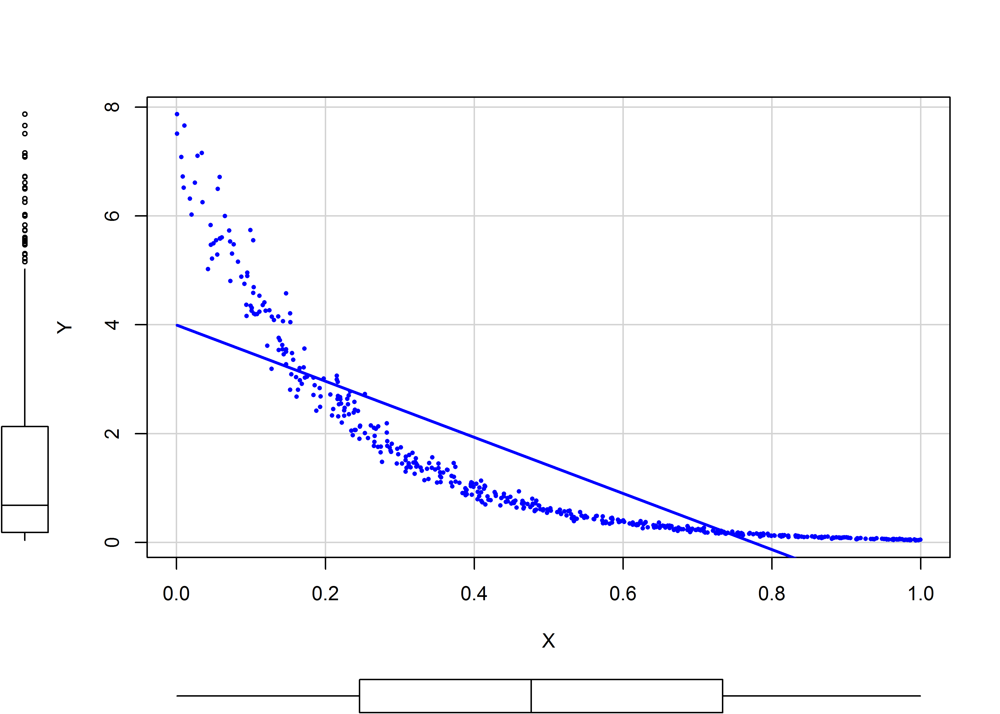
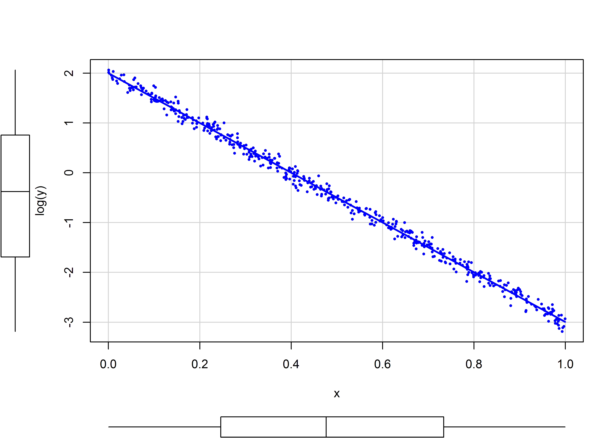
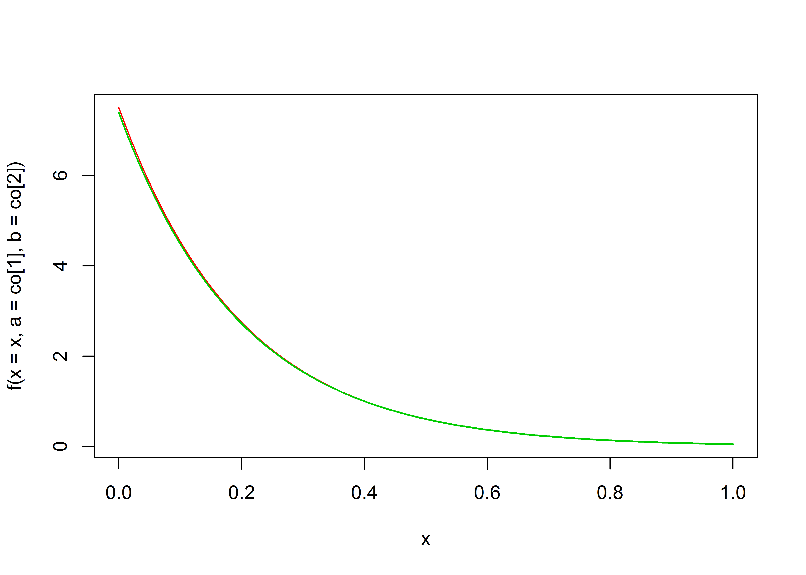

# INTRODUÇÃO

# REVISÃO BIBLIOGRÁFICA

## Esperança matemática ou Valor Esperado

Segundo @wiki:E, a "**esperança matemática** de uma variável aleatória é a soma do produto de cada probabilidade de saída da experiência pelo seu respectivo valor. Isto é, representa o valor médio 'esperado' de uma experiência se ela for repetida muitas vezes". Matematicamente, a Esperança de uma variável aleatória $X$ é representada pelo símbolo $E[X]$, de tal forma que, pela definição dada acima, no caso de uma variável aleatória discreta:

$$E[X] = \sum_{i = 1}^{\infty}x_ip(x_i)$$

Já para uma variável aleatória contínua, o valor esperado torna-se:

$$E[X] = \int_{-\infty}^{\infty}xf(x)dx$$


## O problema da retransformação das variáveis

### Regressão Linear

De acordo com Duan [-@Duan, 606], o Valor Esperado $E$ de uma variável resposta $Y$ que tenha sido transformada em valores $\eta$ durante a regressão linear por uma função $g(Y)$ **não-linear** não é igual ao valor da simples retransformação da variável transforma pela sua função inversa $h(\eta) = g^{-1}(Y)$. Em outros termos[@Duan, 606]:

$$E[Y_0] = E[h(x_0\beta + \epsilon)] \ne h(x_o\beta)$$

Numa regressão linear logaritmizada, ou seja, uma regressão linear com o logarítmo da variável dependente ($h(\eta) = g^{-1}(\eta) = exp(\eta)$), para efetuar apropriadamente a retransformação das estimativas de volta a sua escala original, precisa-se ter em conta a desigualdade mencionada na seção \ref{esperanca-matematica-ou-valor-esperado}.

Segundo [@NBERt0246], quando ajustamos o logaritmo natural de uma variável $Y$ contra outra variável $X$ através da seguinte equação de regressão:

$$ln(Y) = \beta_0 + \beta_1X + \epsilon$$

De acordo com [@NBERt0246, 6; @Duan, 606], se o erro $\epsilon$ é normalmete distribuído, com média zero e desvio padrão $\sigma^2$, ou seja, se $\epsilon \sim N(0, \sigma^2)$, então:

$$E[Y|X] = e^{\beta_0 + \beta_1X} \cdot E[e^\epsilon] \ne e^{\beta_0 + \beta_1X}$$

Embora o valor esperado dos resíduos $\epsilon$ seja igual a zero, ele está submetido a uma transformação não linear, de maneira que não podemos afirmar que $E[e^\epsilon] = 1$, como vimos na seção anterior. Desta maneira, o estimador abaixo é enviesado:

$$E[Y|X] = e^{\beta_0 + \beta_1X}$$

Porém se o termo de erro $\epsilon$ é normalmente distribuído $N(0,\sigma^2)$, então um estimador não-enviesado para o valor esperado $E[Y]$, de acordo com @Duan, assume a forma vista na equação abaixo[@Duan, 606; @NBERt0246, 2 e 6]:

$$E[Y] = e^{\beta_0 + \beta_1X} \cdot e^{\frac{1}{2}\sigma^2}$$

### Modelo linear generalizado (*GLM*)

De acordo com [@NBERt0246, 3-4], um modelo linear generalizado com uma função de ligação logarítimica estimam $log(E[Y|X])$ diretamente, de tal maneira que:

$$log(E[y|X]) = x\beta$$ ou
$$E[Y|X] = e^{x\beta}$$

# ESTUDO DE CASO

Neste estudo comparamos a precisão de diversos tipos de modelos estatísticos (regressão linear, regressão não-linear e modelo linear generalizado) sobre dados gerados com erros randômicos normais com média zero e desvio-padrão $\sigma = 1$.

## Geração de dados randômicos

Para a geração de dados foi utilizada a seguinte expressão teórica, dentro do intervalo $0 \leqslant x \leqslant  1$:

$$y = e^{-5x + 2}$$
Para obter alguma variabilidade, foram adicionados aos valores teóricos de $y$ erros normais $N(0;0,2)$.


```r
set.seed(123)
Nsim <- params$Nsim

a = -5
b = 2

x = runif(Nsim, 0, 1)
y = exp(a*x + b + rnorm(Nsim, 0, .2))
```

* Gráfico dos dados gerados


```r
plot(x,y, pch = 16, cex = 0.5)
```

<div class="figure" style="text-align: center">

<p class="caption">Gráfico dos dados gerados</p>
</div>


### Gráfico da variável transformada


```r
plot(x, log(y), pch = 16, cex = 0.5) 
abline(lm(log(y) ~ x), col = 2)
```

<div class="figure" style="text-align: center">

<p class="caption">Gráfico da variável transformada</p>
</div>

## Ajuste da regressão não-linear


```r
### NLS Fit
NLfit <- nls(y ~ exp(a*x+b), start = c(a = -10, b = 15)) 
```

### Coeficientes


```r
co <- coef(NLfit)
co
```

```
##            a            b 
## -5.036924282  2.037150229
```

### Gráfico do modelo não-linear


```r
f <- function(x,a,b) {exp(a*x+b)}
curve(f(x = x, a = co[1], b = co[2]), col = 2, lwd = 1.2) 
curve(f(x = x, a = -5, b = 2), col = 3, lwd = 1.5, add = TRUE)
```

<div class="figure" style="text-align: center">

<p class="caption">Gráfico do modelo não-linear</p>
</div>

### Estimativas do modelo não-linear


```r
pNLfit <- predict(NLfit, newdata = data.frame(x = .7))
pNLfit
```

```
## [1] 0.2256665598
```

O valor teórico obtido pela equação original ($y = e^{-5x + 2}$) é de:


```r
Yteorico <- exp(-5*.7 + 2)
round(Yteorico, 4)
```

```
## [1] 0.2231
```

$$\epsilon = \frac{\hat{Y} - Y_{teórico}}{Y_{teórico}}$$

O valor obtido pelo modelo é muito próximo do valor teórico. O erro do modelo, portanto, é de 1.14\%.

## Ajuste de modelo linear generalizado

### Poisson


```r
Gfit <- glm(y ~ x, family = poisson())
summary(Gfit)
```

```
## 
## Call:
## glm(formula = y ~ x, family = poisson())
## 
## Deviance Residuals: 
##         Min           1Q       Median           3Q          Max  
## -0.84928622  -0.10703487  -0.00223467   0.08911943   1.13986134  
## 
## Coefficients:
##                Estimate  Std. Error   z value   Pr(>|z|)    
## (Intercept)  2.03777121  0.05686302  35.83650 < 2.22e-16 ***
## x           -5.04801321  0.21002266 -24.03556 < 2.22e-16 ***
## ---
## Signif. codes:  0 '***' 0.001 '**' 0.01 '*' 0.05 '.' 0.1 ' ' 1
## 
## (Dispersion parameter for poisson family taken to be 1)
## 
##     Null deviance: 929.120787  on 499  degrees of freedom
## Residual deviance:  28.124168  on 498  degrees of freedom
## AIC: Inf
## 
## Number of Fisher Scoring iterations: 4
```

#### Estimativa com o modelo linear generalizado com Poisson


```r
pGfit <- predict(Gfit, newdata = data.frame(x = .7), type = "response")
pGfit
```

```
##            1 
## 0.2240607549
```

O valor obtido pelo modelo também é muito próximo do valor teórico obtido pela equação original ($y = e^{-5x + 2}$). Neste caso, o erro do modelo é de 0.417\%.

### Gauss


```r
Gfit2 <- glm(y ~ x, family = gaussian(link = "log"))
summary(Gfit2)
```

```
## 
## Call:
## glm(formula = y ~ x, family = gaussian(link = "log"))
## 
## Deviance Residuals: 
##         Min           1Q       Median           3Q          Max  
## -1.99071791  -0.09962561  -0.00180600   0.05087798   2.66506068  
## 
## Coefficients:
##                Estimate  Std. Error   t value   Pr(>|t|)    
## (Intercept)  2.03715009  0.01278532 159.33511 < 2.22e-16 ***
## x           -5.03692306  0.08321099 -60.53195 < 2.22e-16 ***
## ---
## Signif. codes:  0 '***' 0.001 '**' 0.01 '*' 0.05 '.' 0.1 ' ' 1
## 
## (Dispersion parameter for gaussian family taken to be 0.1896144792)
## 
##     Null deviance: 1635.880265  on 499  degrees of freedom
## Residual deviance:   94.427986  on 498  degrees of freedom
## AIC: 591.55323
## 
## Number of Fisher Scoring iterations: 4
```

#### Estimativa com o modelo linear generalizado com Gauss


```r
pGfit2 <- predict(Gfit2, newdata = data.frame(x = .7), type = "response")
pGfit2
```

```
##           1 
## 0.225666721
```

O valor obtido pelo modelo também é muito próximo do valor teórico obtido pela equação original ($y = e^{-5x + 2}$). Neste caso, o erro do modelo é de 1.14\%. Observar que a adoção de ajuste por modelo linear generalizado com família gaussiana e *log-link* é equivalente ao ajustamento de um modelo de regressão não-linear, como visto na seção anterior.

## Ajuste de Regressão Linear com variável dependente transformada


```r
### LM Fit
fit <- lm(log(y) ~ x)
s <- summary(fit)
s
```

```
## 
## Call:
## lm(formula = log(y) ~ x)
## 
## Residuals:
##         Min          1Q      Median          3Q         Max 
## -0.56559208 -0.12366290  0.00710528  0.13873431  0.53612439 
## 
## Coefficients:
##                Estimate  Std. Error   t value   Pr(>|t|)    
## (Intercept)  1.99999690  0.01808798  110.5705 < 2.22e-16 ***
## x           -4.99122273  0.03167777 -157.5623 < 2.22e-16 ***
## ---
## Signif. codes:  0 '***' 0.001 '**' 0.01 '*' 0.05 '.' 0.1 ' ' 1
## 
## Residual standard error: 0.2012649 on 498 degrees of freedom
## Multiple R-squared:  0.9803348,	Adjusted R-squared:  0.9802953 
## F-statistic: 24825.88 on 1 and 498 DF,  p-value: < 2.2204e-16
```

### Gráfico do modelo linear


```r
#plotmod(fit)
```


### Estimativas

a. Pela mediana


```r
Y <- predict(fit, newdata = data.frame(x = .7))
p_mediana <- exp(Y)
p_mediana
```

```
##            1 
## 0.2245046155
```

O erro do modelo, neste caso, é de 0.616\%.

b. Pela moda


```r
p_moda <- exp(Y - s$sigma^2)
p_moda
```

```
##            1 
## 0.2155922126
```

O erro do modelo, neste caso, é de -3.38\%.

c. Pela média


```r
p_media <- exp(Y + s$sigma^2/2)
p_media
```

```
##            1 
## 0.2290980412
```

O erro do modelo, neste caso, é de 2.67\%.

## Comparação dos resultados obtidos

| Modelo                | Previsão                    | Erro (%)                                    | 
|:----------------------|----------------------------:|--------------------------------------------:|
| **Valor Teórico**     | **0.2231**  | ------                                      |
| Regressão Não-Linear  | 0.2257        |1.14\%     |
| GLM (Poisson)         | 0.2241         |0.417\%      |
| GLM (Gauss)           | 0.2257        |1.14\%     |
| LM (Mediana)          | 0.2245     |0.616\%  |
| LM (Moda)             | 0.2156        |-3.38\%     |
| LM (Média)            | 0.2291       |2.67\%    |

# Método de Monte-Carlo

O resultados acima não devem ser interpretados como taxativos, pois os valores encontrados foram obtidos de dados gerados randomicamente e em único ponto.

Para uma comparação mais precisa entre os modelos testados, utilizamos o método de Monte Carlo em conjunto com a técnica de validação cruzada, simulando os modelos em apenas parte dos dados (*training set*) e fazendo previsões dos dados na outra particação (*test set*).

Para este caso, vamos dividir randomicamente os dados em duas partições iguais, ou seja, os modelos serão gerados nos 50 dados do *test set* e as predições serão comparadas aos 50 dados restantes do *test set*.


```r
pNL <- list()
pG <- list()
pG2 <- list()
p_mediana <- list()
p_moda <- list()
p_media <- list()
ASPE_pNL <- vector(mode = "numeric", length = Nsim/2)
ASPE_pG <- vector(mode = "numeric", length = Nsim/2)
ASPE_pG2 <- vector(mode = "numeric", length = Nsim/2)
ASPE_mediana <- vector(mode = "numeric", length = Nsim/2)
ASPE_moda <- vector(mode = "numeric", length = Nsim/2)
ASPE_media <- vector(mode = "numeric", length = Nsim/2)
df <- data.frame(Y = y, X = x)
for (i in seq_len(Nsim)) {
  subset <- sample(Nsim, Nsim/2, replace = FALSE)
  trainingset <- df[subset, ]  
  testset <-  df[-subset, ]
  NLfit <- nls(Y ~ exp(a*X + b), data = trainingset, start = c(a = -10, b = 15)) 
  Gfit <- glm(Y ~ X, family = poisson(), data = trainingset)
  Gfit2 <- glm(Y ~ X, family = gaussian(link = "log"), data = trainingset)
  fit <- lm(log(Y) ~ X, data = trainingset)
  s <- summary(fit)
  pNL[[i]] <- predict(NLfit, newdata = testset)
  pG[[i]] <- predict(Gfit, newdata = testset, type = "response")
  pG2[[i]] <- predict(Gfit2, newdata = testset, type = "response")
  p_mediana[[i]] <- exp(predict(fit, newdata = testset))
  p_moda[[i]] <- exp(predict(fit, newdata = testset) - s$sigma^2)
  p_media[[i]] <- exp(predict(fit, newdata = testset) + s$sigma^2/2)
  ASPE_pNL[i] <- sum((pNL[[i]] - testset)^2)
  ASPE_pG[i] <- sum((pG[[i]] - testset)^2)
  ASPE_pG2[i] <- sum((pG2[[i]] - testset)^2)
  ASPE_mediana[i] <- sum((p_mediana[[i]] - testset)^2)
  ASPE_moda[i] <- sum((p_moda[[i]] - testset)^2)
  ASPE_media[i] <- sum((p_media[[i]] - testset)^2)
}
mean(ASPE_pNL)
```

```
## [1] 1288.194588
```

```r
mean(ASPE_pG)
```

```
## [1] 1285.677349
```

```r
mean(ASPE_pG2)
```

```
## [1] 1288.194148
```

```r
mean(ASPE_mediana)
```

```
## [1] 1208.550019
```

```r
mean(ASPE_moda)
```

```
## [1] 1123.6968
```

```r
mean(ASPE_media)
```

```
## [1] 1255.342248
```

* Gráficos

<div class="figure" style="text-align: center">

<p class="caption">Histogramas das variáveis simuladas</p>
</div>


# REFERÊNCIAS {-}
