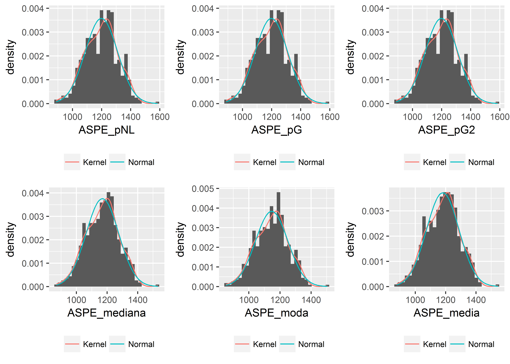

# INTRODUÇÃO

# REVISÃO BIBLIOGRÁFICA

## Esperança matemática ou Valor Esperado

Segundo @wiki:E, a "**esperança matemática** de uma variável aleatória é a soma do produto de cada probabilidade de saída da experiência pelo seu respectivo valor. Isto é, representa o valor médio 'esperado' de uma experiência se ela for repetida muitas vezes". Matematicamente, a Esperança de uma variável aleatória $X$ é representada pelo símbolo $E[X]$, de tal forma que, pela definição dada acima, no caso de uma variável aleatória discreta:

$$E[X] = \sum_{i = 1}^{\infty}x_ip(x_i)$$

Já para uma variável aleatória contínua, o valor esperado torna-se:

$$E[X] = \int_{-\infty}^{\infty}xf(x)dx$$


## O problema da retransformação das variáveis

De acordo com Duan [-@Duan, 606], o Valor Esperado $E$ de uma variável resposta $Y$ que tenha sido transformada em valores $\eta$ durante a regressão linear por uma função $g(Y)$ **não-linear** não é igual ao valor da simples retransformação da variável transforma pela sua função inversa $h(\eta) = g^{-1}(Y)$. Em outros termos[@Duan, 606]:

$$E[Y_0] = E[h(x_0\beta + \epsilon)] \ne h(x_o\beta)$$

Numa regressão linear logaritmizada, ou seja, uma regressão linear com o logarítmo da variável dependente, para efetuar apropriadamente a retransformação das estimativas de volta a sua escala original, precisa-se ter em conta a desigualdade mencionada na seção \ref{esperanca-matematica-ou-valor-esperado}.

Segundo @NBERt0246, quando ajustamos o logaritmo natural de uma variável $Y$ contra outra variável $X$ através da seguinte equação de regressão:

$$ln(Y) = \beta_0 + \beta_1X + \epsilon$$

Sabe-se que a melhor estimativa que se pode fazer da variável dependente $Y$ é o seu Valor Esperado, que neste caso vale:

$$E[Y] = e^{\beta_0 + \beta_1X} \cdot E[e^\epsilon]$$

Embora o valor esperado dos resíduos $\epsilon$ seja igual a zero, ele está submetido a uma transformação não linear, de maneira que não podemos afirmar que $E[e^\epsilon] = 1$, como vimos na seção anterior. Desta maneira, o estimador abaixo é enviesado:

$$E[Y] = e^{\beta_0 + \beta_1X}$$

Se o termo de erro $\epsilon$ é normalmente distribuído $N(0,\sigma^2)$, então um estimador não-enviesado para o valor esperado $E[Y]$, de acordo com @Duan, assume a forma vista na equação abaixo @Duan[apud @NBERt0246, p.2 e 6]:

$$E[Y] = e^{\beta_0 + \beta_1X} \cdot e^{\frac{1}{2}\sigma^2}$$

# ESTUDO DE CASO

Neste estudo comparamos a precisão de diversos tipos de modelos estatísticos (regressão linear, regressão não-linear e modelo linear generalizado) sobre dados gerados com erros randômicos normais com média zero e desvio-padrão $\sigma = 1$.

## Geração de dados randômicos

Para a geração de dados foi utilizada a seguinte expressão teórica, dentro do intervalo $0 \leqslant x \leqslant  1$:

$$y = e^{-5x + 2}$$
Para obter alguma variabilidade, foram adicionados aos valores teóricos de $y$ erros normais $N(0;0,2)$.


```r
set.seed(123)

a = -5
b = 2

x = runif(100, 0, 1)
y = exp(a*x + b + rnorm(100, 0, .2))
```

* Gráfico dos dados gerados


```r
plot(x,y, pch = 16, cex = 0.5)
```

<div class="figure" style="text-align: center">

<p class="caption">Gráfico dos dados gerados</p>
</div>


### Gráfico da variável transformada


```r
plot(x, log(y), pch = 16, cex = 0.5) 
abline(lm(log(y) ~ x), col = 2)
```

<div class="figure" style="text-align: center">

<p class="caption">Gráfico da variável transformada</p>
</div>

## Ajuste da regressão não-linear


```r
### NLS Fit
NLfit <- nls(y ~ exp(a*x+b), start = c(a = -10, b = 15)) 
```

### Coeficientes


```r
co <- coef(NLfit)
co
```

```
##            a            b 
## -4.896555212  1.997874467
```

### Gráfico do modelo não-linear


```r
f <- function(x,a,b) {exp(a*x+b)}
curve(f(x = x, a = co[1], b = co[2]), col = 2, lwd = 1.2) 
curve(f(x = x, a = -5, b = 2), col = 3, lwd = 1.5, add = TRUE)
```

<div class="figure" style="text-align: center">

<p class="caption">Gráfico do modelo não-linear</p>
</div>

### Estimativas do modelo não-linear


```r
pNLfit <- predict(NLfit, newdata = data.frame(x = .7))
pNLfit
```

```
## [1] 0.2393773308
```

O valor teórico obtido pela equação original ($y = e^{-5x + 2}$) é de:


```r
Yteorico <- exp(-5*.7 + 2)
round(Yteorico, 4)
```

```
## [1] 0.2231
```

$$\epsilon = \frac{\hat{Y} - Y_{teórico}}{Y_{teórico}}$$

O valor obtido pelo modelo é muito próximo do valor teórico. O erro do modelo, portanto, é de 7.28\%.

## Ajuste de modelo linear generalizado

### Poisson


```r
Gfit <- glm(y ~ x, family = poisson())
summary(Gfit)
```

```
## 
## Call:
## glm(formula = y ~ x, family = poisson())
## 
## Deviance Residuals: 
##         Min           1Q       Median           3Q          Max  
## -0.78105080  -0.11407910  -0.02334406   0.04517457   0.78120241  
## 
## Coefficients:
##               Estimate Std. Error   z value   Pr(>|z|)    
## (Intercept)  2.0129853  0.1265714  15.90394 < 2.22e-16 ***
## x           -4.9957447  0.4647721 -10.74881 < 2.22e-16 ***
## ---
## Signif. codes:  0 '***' 0.001 '**' 0.01 '*' 0.05 '.' 0.1 ' ' 1
## 
## (Dispersion parameter for poisson family taken to be 1)
## 
##     Null deviance: 184.288851  on 99  degrees of freedom
## Residual deviance:   4.991623  on 98  degrees of freedom
## AIC: Inf
## 
## Number of Fisher Scoring iterations: 4
```

#### Estimativa com o modelo linear generalizado com Poisson


```r
pGfit <- predict(Gfit, newdata = data.frame(x = .7), type = "response")
pGfit
```

```
##            1 
## 0.2267207901
```

O valor obtido pelo modelo também é muito próximo do valor teórico obtido pela equação original ($y = e^{-5x + 2}$). Neste caso, o erro do modelo é de 1.61\%.

### Gauss


```r
Gfit2 <- glm(y ~ x, family = gaussian(link = "log"))
summary(Gfit2)
```

```
## 
## Call:
## glm(formula = y ~ x, family = gaussian(link = "log"))
## 
## Deviance Residuals: 
##         Min           1Q       Median           3Q          Max  
## -1.52566206  -0.10270628  -0.01630332   0.02118162   2.06949483  
## 
## Coefficients:
##               Estimate Std. Error   t value   Pr(>|t|)    
## (Intercept)  1.9978743  0.0268358  74.44810 < 2.22e-16 ***
## x           -4.8965539  0.1736556 -28.19692 < 2.22e-16 ***
## ---
## Signif. codes:  0 '***' 0.001 '**' 0.01 '*' 0.05 '.' 0.1 ' ' 1
## 
## (Dispersion parameter for gaussian family taken to be 0.1633725569)
## 
##     Null deviance: 313.906827  on 99  degrees of freedom
## Residual deviance:  16.010526  on 98  degrees of freedom
## AIC: 106.59533
## 
## Number of Fisher Scoring iterations: 4
```

#### Estimativa com o modelo linear generalizado com Gauss


```r
pGfit2 <- predict(Gfit2, newdata = data.frame(x = .7), type = "response")
pGfit2
```

```
##            1 
## 0.2393775107
```

O valor obtido pelo modelo também é muito próximo do valor teórico obtido pela equação original ($y = e^{-5x + 2}$). Neste caso, o erro do modelo é de 7.28\%. Observar que a adoção de ajuste por modelo linear generalizado com família gaussiana e *log-link* é equivalente ao ajustamento de um modelo de regressão não-linear, como visto na seção anterior.

## Ajuste de Regressão Linear com variável dependente transformada


```r
### LM Fit
fit <- lm(log(y) ~ x)
s <- summary(fit)
s
```

```
## 
## Call:
## lm(formula = log(y) ~ x)
## 
## Residuals:
##         Min          1Q      Median          3Q         Max 
## -0.44759471 -0.12264594 -0.00394687  0.11926677  0.44344532 
## 
## Coefficients:
##                Estimate  Std. Error   t value   Pr(>|t|)    
## (Intercept)  1.99820803  0.03921100  50.96040 < 2.22e-16 ***
## x           -5.01796627  0.06836424 -73.40045 < 2.22e-16 ***
## ---
## Signif. codes:  0 '***' 0.001 '**' 0.01 '*' 0.05 '.' 0.1 ' ' 1
## 
## Residual standard error: 0.1938582 on 98 degrees of freedom
## Multiple R-squared:  0.9821351,	Adjusted R-squared:  0.9819528 
## F-statistic: 5387.626 on 1 and 98 DF,  p-value: < 2.2204e-16
```

### Gráfico do modelo linear


```r
#plotmod(fit)
```


### Estimativas

a. Pela mediana


```r
Y <- predict(fit, newdata = data.frame(x = .7))
p_mediana <- exp(Y)
p_mediana
```

```
##            1 
## 0.2199470683
```

O erro do modelo, neste caso, é de -1.43\%.

b. Pela moda


```r
p_moda <- exp(Y - s$sigma^2)
p_moda
```

```
##            1 
## 0.2118346261
```

O erro do modelo, neste caso, é de -5.06\%.

c. Pela média


```r
p_media <- exp(Y + s$sigma^2/2)
p_media
```

```
##            1 
## 0.2241190594
```

O erro do modelo, neste caso, é de 0.443\%.

## Comparação dos resultados obtidos

| Modelo                | Previsão                    | Erro (%)                                    | 
|:----------------------|----------------------------:|--------------------------------------------:|
| **Valor Teórico**     | **0.2231**  | ------                                      |
| Regressão Não-Linear  | 0.2394        |7.28\%     |
| GLM (Poisson)         | 0.2267         |1.61\%      |
| GLM (Gauss)           | 0.2394        |7.28\%     |
| LM (Mediana)          | 0.2199     |-1.43\%  |
| LM (Moda)             | 0.2118        |-5.06\%     |
| LM (Média)            | 0.2241       |0.443\%    |

# Método de Monte-Carlo

O resultados acima não devem ser interpretados como taxativos, pois os valores encontrados foram obtidos de dados gerados randômicamente.

Para uma comparação mais precisa entre os modelos testados, utilizamos o método de Monte Carlo, simulando os dados randomicamente a cada iteração. Finalmente, comparamos o valor médio obtido por cada cada modelo ao valor téorico.


```r
Nsim <- 500
pNL <- vector(mode = "numeric", length = Nsim)
pG <- vector(mode = "numeric", length = Nsim)
pG2 <- vector(mode = "numeric", length = Nsim)
p_mediana <- vector(mode = "numeric", length = Nsim)
p_moda <- vector(mode = "numeric", length = Nsim)
p_media <- vector(mode = "numeric", length = Nsim)
for (i in 1:Nsim) {
  y = exp(a*x + b + rnorm(100, 0, .2))
  NLfit <- nls(y ~ exp(a*x+b), start = c(a = -10, b = 15)) 
  Gfit <- glm(y ~ x, family = poisson())
  Gfit2 <- glm(y ~ x, family = gaussian(link = "log"))
  fit <- lm(log(y) ~ x)
  s <- summary(fit)
  pNL[i] <- predict(NLfit, newdata = data.frame(x = .7))
  pG[i] <- predict(Gfit, newdata = data.frame(x = .7), type = "response")
  pG2[i] <- predict(Gfit2, newdata = data.frame(x = .7), type = "response")
  p_mediana[i] <- exp(predict(fit, newdata = data.frame(x = .7)))
  p_moda[i] <- exp(predict(fit, newdata = data.frame(x = .7)) - s$sigma^2)
  p_media[i] <- exp(predict(fit, newdata = data.frame(x = .7)) + s$sigma^2/2)
}
```

* Gráficos

<div class="figure" style="text-align: center">

<p class="caption">Histogramas das variáveis simuladas</p>
</div>


| Modelo                |Previsão                     |$\sigma^2$                  |Erro                   |     
|:----------------------|----------------------------:|---------------------------:|----------------------:|   
| **Valor Teórico**     |**0.2231**   |------                      |------                 |   
| Regressão Não-Linear  |0.2275      |0.0389       |1.96\%       |  
| GLM (Poisson)         |0.2279       |0.0111        |2.16\%        |  
| GLM (Gauss)           |0.2275      |0.0389       |1.96\%       |  
| LM (Mediana)          |0.2236|0.0052 |0.207\% |  
| LM (Moda)             |0.2148   |0.0052    |-3.72\%    |  
| LM (Média)            |0.2281  |0.0053   |2.23\%   |    

# REFERÊNCIAS {-}
